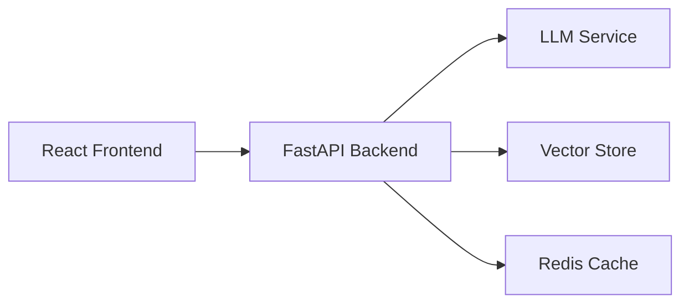

# Curriculum interactivo con IA 🤖

Crea tu propio portafolio de conversaciones atractivo, impulsado por IA. Este proyecto de código abierto permite a los desarrolladores crear portafolios interactivos donde los visitantes pueden mantener conversaciones significativas con un asistente de IA que conoce tu trabajo, experiencia y conocimientos.

## ✨ Características principales

- 🤖 **Asistente interactivo de inteligencia artificial**: Involucre a los visitantes con conversaciones personalizadas y adaptadas al contexto.
- 🚀 **Transmisión en tiempo real**: Experiencia fluida, similar a un chat, con respuestas en tiempo real
- 🎨 **Interfaz de usuario moderna**: Diseño limpio y responsivo centrado en la conversación.
- 🔄 **Fácil de personalizar**: Crea tu propia plantilla y modifícala para tu marca personal.
- 🛠 **Arquitectura modular**: Diseñado para facilitar su mantenimiento y ampliación.

## 🏗 Arquitectura

### Tecnologia

- **Frontend**: React + Vite, TailwindCSS, Framer Motion
- **Backend**: FastAPI, PostgreSQL + pgvector, Redis

## 🚀 Inicio rápido

1. Crea un nuevo repositorio a partir de esta plantilla y clónalo.
2. Agrega los archivos necesarios a frontend/public y modifica el archivo config.json con tu propio contenido: [Guía de configuración de la configuración](frontend/CONFIGURATION.md).
2. Ejecuta "docker compose build" y luego "docker compose up" para iniciar los contenedores y disfrutarlos en [localhost](http//:localhost:3000).
3. Implementa en [fly.io](fly.io) o configura localmente: [Guía de configuración del backend](backend/README.md).
4. Implementa en [vercel.com](vercel.com) o configura localmente: [Guía de configuración del frontend](frontend/README.md).

## 🤝 Contribuyendo

¡Agradecemos sus contribuciones! No dude en enviar una solicitud de incorporación de cambios.

## 📝 Licencia

Este proyecto está licenciado bajo la licencia MIT: consulte el archivo [LICENSE](LICENSE) para obtener más detalles.

Gracias a Alon Trugman por este gran trabajo.
Traduccion al español y modificaciones Fabri Arzaguet.

